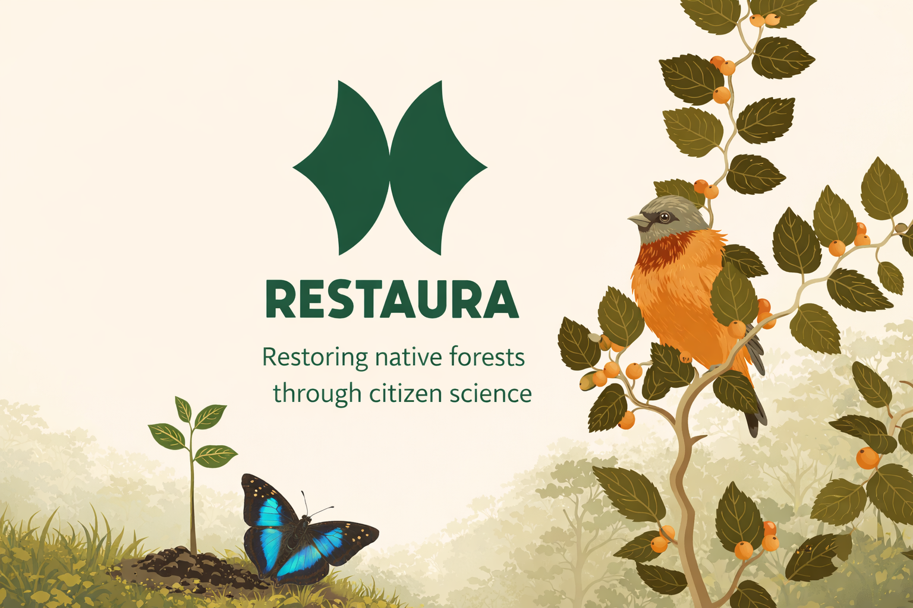
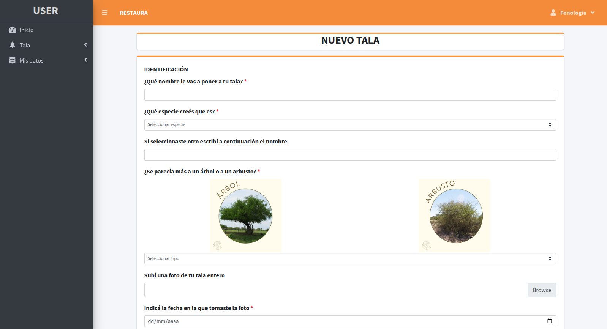
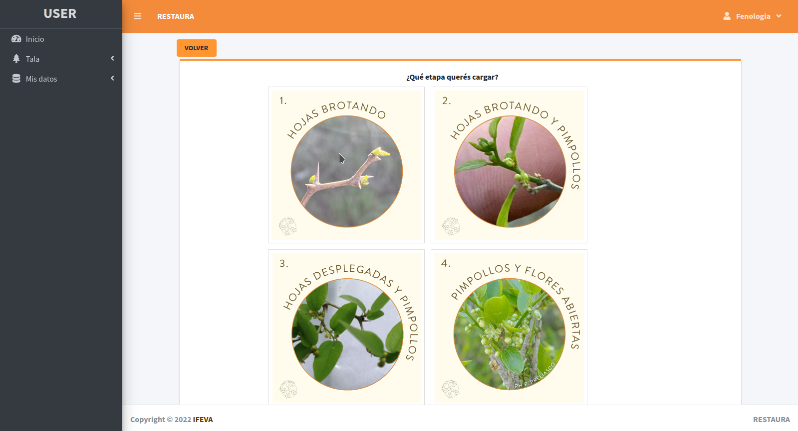
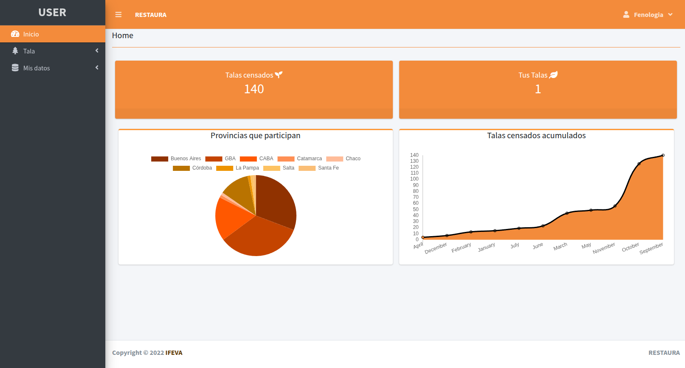
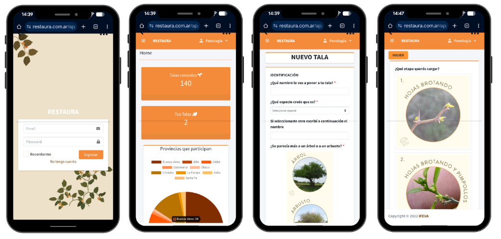

  

# RESTAURA  

  <strong>Restaura: open web platform for participatory phenological monitoring of native trees in Argentina</strong> 
  <em>Plataforma web abierta para el seguimiento fenológico participativo de árboles nativos de Argentina</em>

---

## 🌱 What is Restaura?

**Restaura** is an open-source web application designed to collect, organize, and visualize phenological data from native species through citizen science projects.  
Its main goal is to facilitate the generation of key information for ecological restoration by integrating social participation with open, reproducible digital infrastructures.

The platform enables people without technical training to record phenological observations of native trees (budburst, flowering, fruiting, and senescence), generating data useful for seed provision, ecological monitoring, and restoration-oriented decision-making.

---

## 🌎 Motivation

Native forest restoration faces multiple challenges, including the lack of information about **when and where to collect seeds**.  
Plant phenology is key to addressing this issue, but it requires simultaneous observations across large geographic areas.

Restaura was developed in response to this need, combining:
- citizen science,
- free and open-source software,
- data sovereignty,
- and technological accessibility.

---

## 🔍 What can Restaura do?

- User registration and role management  
- Registration of georeferenced specimens  
- Recording of standardized phenological events  
- Optional association of photographs  
- Data visualization through interactive maps and charts  
- Data export in open formats (CSV, Excel)  

The platform is designed to be **adaptable to different species and projects** by modifying forms, variables, and protocols.

---

## 🌳 Use case: *Tu Tala Amigo*

The first implementation of Restaura was **Tu Tala Amigo**, a citizen science project focused on phenological monitoring of *Celtis spp.* (tala), a native tree species from Argentina occurring in threatened forest ecosystems.

Between 2023 and 2024:
- 233 people participated,
- 140 specimens were registered,
- observations were collected across 8 Argentine provinces.

This case study allowed us to validate the platform’s usability, stability, and potential as an open digital infrastructure.

---

## 🧱 System architecture

Restaura follows a classical three-tier architecture:

- **Frontend:** HTML, CSS, JavaScript, Bootstrap, jQuery  
- **Backend:** PHP  
- **Database:** MySQL  

The system is designed for **LAMP environments (Linux, Apache, MySQL, PHP)** and does not rely on external services.  
The architecture prioritizes simplicity, reproducibility, and low maintenance costs.

---

## ⚙️ Installation

1. Clone the repository  
2. Copy the files into the Apache root directory  
3. Import the database from `EstructuraDB.sql`  
4. Configure the database connection in `db_connect.php`  

Once these steps are completed, the application is ready to run.

*(A detailed installation manual will be published soon.)*

---

## 📍 Geographic scope

RESTAURA was initially designed for projects developed in **Argentina**.

For this reason, the database includes:
- a catalog of **Argentine provinces**,
- corresponding localities within the national territory.

This decision reflects the project context and the specific needs of native forest restoration initiatives in Argentina.

Nevertheless, the system architecture allows adaptation to other countries by modifying or extending the geographic tables.

---

## 📊 Data, ethics, and privacy

Following open science principles:
- informed consent is requested from participants,
- locations and photographs are shared in aggregated or anonymized form,
- complete datasets are securely stored on the project server.

This approach balances openness, traceability, and participant privacy.

---

## 👤 User roles

RESTAURA uses a role-based system to ensure open participation while protecting sensitive information.

- **Administrator**
  - User and role management  
  - Full access to all data  
  - Export of tables (users, login sessions, specimens, and events)  
  - Access to detailed statistics  

- **Phenology**
  - Registration of specimens and phenological events  
  - Access only to general statistics  
  - No access to sensitive data from other participants  

This structure follows best practices in **ethics, privacy, and citizen science**.

---

## 🚧 Project status

Restaura is an **active and evolving** project.  
Future plans include:
- extending the system to additional native species,
- strengthening the user community,
- improving security and technical documentation.

---

## 🖥️ Platform screenshots

Below are some screenshots of the Restaura interface as used in the *Tu Tala Amigo* project.

### Specimen registration

### Phenological event submission

### Data visualization

### Mobile use

---

## 📖 How to cite

### Software

If you use **RESTAURA** in an academic work, please cite the software version:

Figueroa Schibber, E., et al. (2026). *RESTAURA: Open web infrastructure for participatory phenological monitoring of native trees in Argentina* (v1.0.2) [Software]. Zenodo. https://doi.org/10.5281/zenodo.18200027

---

### Academic work

To cite the **conceptual framework, project design, or methodological context**, please refer to the conference contribution:

Figueroa Schibber, E., et al. (2025). *Tu Tala Amigo: plataforma web abierta para el seguimiento fenológico participativo de árboles nativos de Argentina* (Versión v1). 2do Congreso Iberoamericano de Ciencia Abierta (CIbCA2025), Quito, Ecuador. Zenodo. https://doi.org/10.5281/zenodo.17476863

---

## 📄 License

This project is distributed under the **GNU GPL v3.0 or later (GPL-3.0-or-later)** license.  
See the `LICENSE` file for details.

---

## 👥 Team and contact

This project was developed by an interdisciplinary team of researchers in ecology, citizen science, and open technologies.

🌐 Website: https://www.restaura.com.ar  
📧 Contact: eschibber@agro.uba.ar  
🔗 Repository: https://github.com/RESTAURA-project
